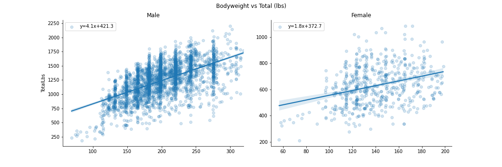

# Oklahoma Powerlifting EDA: Project Overview
* Explored Oklahoma competitive powerlifting data from 1991 to 2020.
* Downloaded dataset with over 2.1 million records from [openpowerlifting.org](https://www.openpowerlifting.org/).
* Cleaned the data, paying attention to duplication and reasonableness of values.
* Imputed for missing values and engineered a couple features to assist in the EDA.
* Outputted filtered and cleaned data subset as CSV file.
* Created meaningful visualizations to better understand characteristics and trends in the data.

## Tools Used

**Python**: 3.8.3  
**Packages**: pandas, numpy, matplotlib, seaborn, scipy  
**For exact package versions**: `pip install -r requirements.txt`

## Data Cleaning

The following changes were made to the original data, to best support the analysis I was trying to do:

* Filtered for only tested, full powerlifting meets in Oklahoma
  - `Tested` == 'Yes', `MeetCountry` == 'USA', `MeetState` == 'OK', `Event` == 'SBD'
* Dropped many unneeded features, such as age-related columns, columns filtered for just one value, any lift features other than the lifter's best for each lift, etc.
* Filtered out any records where the lifter was disqualified or failed to register a successful attempt for any of the three lifts
* Removed duplicate records (primarily caused by lifters entering multiple divisions within the same meet, necessitating duplicated results with different `Division` values)
* Created a `MeetYear` feature, from the `Date` column
* Created a corresponding column in lbs for all columns in kgs.

## EDA

A few of the visual highlights:

**Competitive powerlifting is a lot less male dominated than it used to be.**

**While the lifts are all strongly correlated with each other, there is a lot of variation in a lifter's relative strength (especially for women).**

**Every pound of bodyweight is expected to add 2.3 times more powerlifting strength for men than for women.**

## Bonus Section: Impressive Powerlifters

Just wanted to take a second to share some of the impressive powerlifters I learned about during this project!

**[Mike Ewoldsen](https://www.htrnews.com/story/news/local/2016/06/24/powerlifter-mike-ewoldsen-ends-ministry-two-rivers/86342206/)**  
*Traveling minister and world champion lifter*

**[Teale Adelmann](https://www.liftinglarge.com/Who-We-Are)**  
*NASA Hall of Fame inductee and lifting gear store owner*

**[Dr. Nathan Burford](https://www.instagram.com/tastynate_phd)**  
*PhD holder, craftsman, and elite powerlifter*

